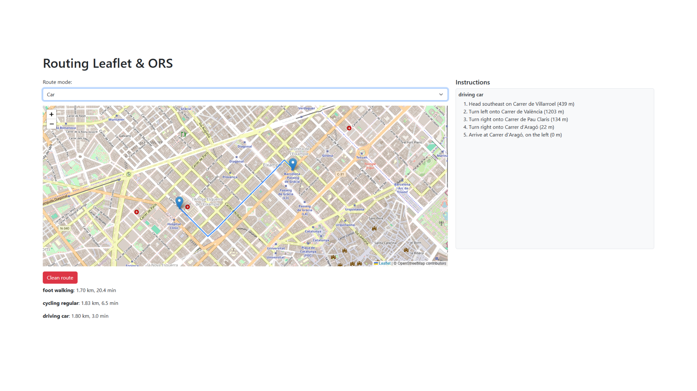

# 🗺️ Routing with Leaflet & OpenRouteService

This project is a simple web application that allows users to draw a route between two points on the map using different travel modes (foot, bike, car) powered by [OpenRouteService](https://openrouteservice.org/) and displayed with [Leaflet](https://leafletjs.com/).

## 🚀 Features

- Click on map to select start and end points
- Choose routing mode (car, bike, foot)
- View distance and duration for each mode
- See turn-by-turn instructions
- Clean/reset map and start over

## 🖼️ Demo
https://ors.rutaplanner.com/

## ⚙️ Technologies

- HTML/CSS/JavaScript
- Leaflet.js
- OpenRouteService Directions API

## 📦 Setup

1. Clone this repo
2. Get a free API key from [OpenRouteService](https://openrouteservice.org/sign-up/)
3. Replace `"TU_API_KEY_AQUI"` in `script.js` with your API key
4. Open `index.html` in your browser

## 📝 License

MIT

---

👨‍💻 Built for learning and freelance portfolio projects.
